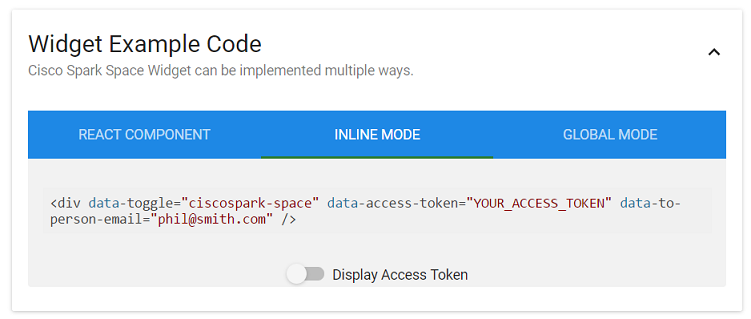

# ステップ 3：既存のアプリケーションに Webex ウィジェットを組み込む

前のステップでは、1 対 1 のルームでの「Space」ウィジェットのメッセージングや音声/ビデオ機能を体験しました。
ここでは、既存の Web サイトやアプリケーションに、開発者がウィジェットを追加する方法について説明します。

「Space」ウィジェットのページに戻り、ページの最後の項目を確認します。

下のスナップショットにあるように、複数のコード スニペットが例として表示されます。
各コード スニペットは、それぞれ別のプログラミング形式に対応しています。
［インライン（Inline）］タイプ、および［グローバル（Global）］タイプのコード スニペットは、HTML アプリケーションに追加できます。一方、［リアクト コンポーネント（React component）］スタイルの場合は、Web アプリケーションが、「React」テンプレートに基づいている必要があります。

［インライン モード（Inline mode）］タブをクリックし、HTML コードを確認します。非常に簡単です。

<div align="left"></div><br/><br/>


次に、「Space」ウィジェットを組み込んだ HTML ページ全体のサンプルを示します。1 対 1 モードに設定されており、下の「data-to-person-email」プロパティで指定されています。

```html
<html>
  <head>
    <meta charset="utf8">
    <title>Space Widget Demo</title>
    <link rel="stylesheet" href="https://code.s4d.io/widget-space/production/main.css">
  </head>
  <body>
    <div style="width: 500px; height: 500px;"
        data-toggle="ciscospark-space"
        data-access-token="YOUR_ACCESS_TOKEN"
        data-to-person-email="phil@smith.com"
 	/>
    <script src="https://code.s4d.io/widget-space/production/bundle.js"></script>
  </body>
</html>
```

**このコードを実際に試したい場合は、ラップトップに「widget.html」という名前のファイルを作成し、上記の HTML コードを貼り付けてください。**

「data-access-token」の値を自身の Webex トークンに、「email」の値を通信相手の Webex ハンドルに置き換えるのを忘れないようにしてください。

_実際にアプリケーションに実装する場合は、ハード コードするのではなく、[Webex OAuth 統合](https://developer.ciscospark.com/authentication.html)を使用して、アクセス トークンを動的に取得して HTML コードに挿入するようにしてください。_

最後に、Web ブラウザから「widget.html」のページを開き、1 対 1 のスペースでのやり取りを始めます。


## 今後の応用

このラボでは、「Space」ウィジェットによってもたらされるエクスペリエンスのほんの一例を紹介しました。

実際には、「Space」ウィジェットでは、[イベントの発生に応じてカスタム コードを追加](https://github.com/ciscospark/react-ciscospark/blob/master/packages/node_modules/%40ciscospark/widget-space/README.md#events)することができます。
また、「メッセージ」ビューや「会議」ビューから起動させることもできます。詳細については、[ウィジェットの参照資料](https://github.com/ciscospark/react-ciscospark/blob/master/packages/node_modules/%40ciscospark/widget-space/README.md#html)を参照してください。

さらに、「Space」ウィジェットでは、グループ スペースにメッセージを送ることが可能です。つまり、Web ページから直接、ヘルプ デスク スペースで会話することができます。上記のデモの「spaceId」オプションで、既存の Webex ルームの ID を試してみてください。
_ID を簡単に取得したい場合は、既存のルームに「RoomId@sparkbot.io」ボットを追加し、1 対 1 のチャットで ID を返信させてください。_

最後に、[オンライン デモ](https://code.s4d.io/widget-recents/production/demo/index.html)をみて、[「Recents」ウィジェット](https://github.com/ciscospark/react-ciscospark/blob/master/packages/node_modules/%40ciscospark/widget-recents/README.md)での体験がどのようなものか確認してください。
