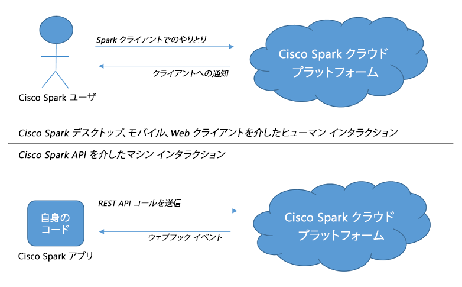

# Webex アプリの概要

## 目的

このラボでは、現行の Webex の拡張に関する「全体像」について振り返ります。

Webex API の概要説明では、Webex のプログラマビリティを体験するためにインタラクティブなドキュメントを使用します。
その後、いくつかの使用例を通じて、Webex アプリの基本について詳細を確認しましょう。

ラボを終えれば、充分な知識を得て、Webex のラーニング ラボを容易に活用できるようになります。
また、「[Webex For Developers（開発者向け Webex）](https://developer.ciscospark.com/)」や、
DevNet の「[Webex Community of Interest（Webex に関心がある人のコミュニティ）](https://developer.cisco.com/site/coi/)」などの豊富な技術リソースにもアクセスできます。

## 事前準備

このラボに参加するには、Webex のユーザ アカウントが必要になります。
まだ、Webex のユーザになっていない場合は、[こちらをクリックしてサインアップしてください](https://web.ciscospark.com/)。

## ステップ 1：Webex の拡張について

Webex を拡張することで、次のようなアプリケーションを作成することができます。
- タスクの自動化：ルームの作成、メッセージの投稿、既存ルームへの参加者の追加など。
- アクションを Webex でのイベントとして処理：参加者がルームに追加された、新規メッセージが作成されたなど。

  

タスクを自動化するには、カスタム アプリケーションで [Webex REST API](https://developer.ciscospark.com/quick-reference.html) を使用します。

API により、Webex の次のような主要機能とやり取りすることができます。
- [Spaces](https://developer.ciscospark.com/resource-rooms.html)：Space の作成、更新、削除。
- [Teams](https://developer.ciscospark.com/resource-teams.html)：Team の作成、更新、削除。
- [People](https://developer.ciscospark.com/resource-people.html)：Webex ユーザの検索。
- [Messages](https://developer.ciscospark.com/resource-messages.html)：メッセージの作成、削除。
- [Memberships](https://developer.ciscospark.com/resource-memberships.html)および[Team Memberships](https://developer.ciscospark.com/resource-team-memberships.html)：ルームやチームでの参加者の追加、削除。モデレータとして参加者を支援。

また、アプリケーションを [Webhooks](https://developer.ciscospark.com/resource-webhooks.html) に登録することもできます。
登録することで、新規メッセージの投稿やユーザのルームへの参加/退去など、さまざまなイベントの通知を受け取ることができます。

なお、上で示したドキュメントにアクセスすることで、ご利用の Web ブラウザから Webex API との直接のやり取りが生じることになります。
このラボでインタラクティブなドキュメントを活用するということ自体が、ラボの拡張によるものです。
拡張というコンセプトを具体的に理解していただける良い機会ではないかと思います。
