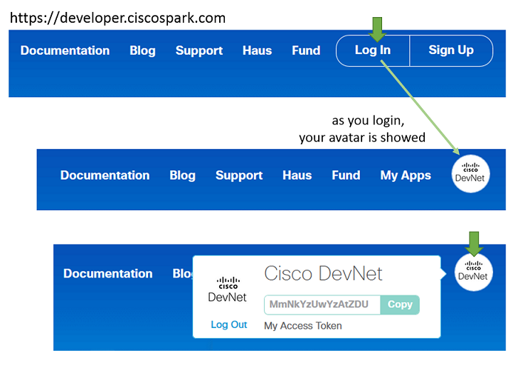

# ステップ 2：Webex API ドキュメントを参照する

「Webex for Developers」には、Webex REST API のドキュメントがまとめられています。https://developer.ciscospark.com からアクセスできます。

[Webex for Developers](https://developer.ciscospark.com)を開きます。

右上隅の［ログイン（Log In）］をクリックし、Webex のクレデンシャルを入力します。
Webex のアカウントを持っていない場合は、［サイン アップ（Sign up）］をクリックします。

一度ログインすると、右上隅に自身のアバターが表示されるはずです。

パーソナル シークレットを表示させるには、画像をクリックします。
このシークレットは、「Webex API アクセス トークン」または「開発者アクセス トークン」と呼ばれます。

  

Webex API アクセス トークンは、それぞれ一意なものとなっており、その所有者を示す ID として機能します。
つまり、開発者アクセス トークンは、「もうひとりの自分」です。

**アクセス トークンが第三者に知られてしまった場合は、Webex API のサポートに連絡していただき、無効にするようにしてください。
無効にしたいトークンをコピーおよびペーストして、[devsupport@ciscospark.com](mailto:devsupport@ciscospark.com) までメールで送信してください。**

トップ メニューの［ドキュメント（Docs）］をクリックします。
左メニューの項目から、[［Quick リファレンス（Quick Reference）］](https://developer.ciscospark.com/quick-reference.html)を探します。

API によって公開されているさまざまな Webex の機能が確認できます。People、Rooms（Spaces として知られます）、Memberships、Messagesm、Teams などがあります。

次のステップでは、このドキュメントに沿って、新しい Space を実際に作成します。
