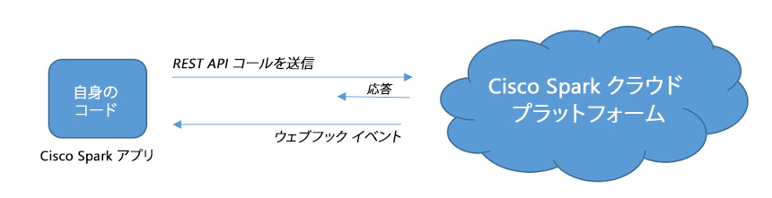

# ステップ 4：Webex アプリケーション

ステップ 2 と 3 で体験したように、Webex アプリは単なるコードに留まるものではなく、自動的かつ事前に定義された方法で Webex とやり取りができるものです。

  

次に示すような、さまざまなタイプのアプリケーションを作成できることを想像してみてください。

**I. Webex アプリでは、特定の情報が含まれた新しいメッセージや、ルームに新たに追加された参加者など、新規イベントをリッスンすることができます。
これらのイベントが発生すると、コードの定められた動作が適宜実行されます。たとえば、アラートをあげるために SMS を送信する、
企業のバックエンドにデータを挿入するための Webex メッセージを解析する、などの動作を行えます。**

_Webex では、こうしたタイプのアプリケーションは、「コントローラ」と呼ばれます。
Webex アプリがリッスンしているだけで、特に動作を行わない場合は、「ウォッチャ」と呼ばれます。_
  

**II. ビジネス プロセスでイベントが生じた際に「ビジネス アクティビティ」ルームにメッセージを送信する Webex アプリを作成することもできます。
新規顧客のサイン イン、注文の作成やキャンセルなどが対象となります。
「ビジネス アクティビティ」ルームを事前に用意しておくことで、メッセージが入ってきた際に、さらにアクションが必要かどうかを人間の担当者が確認することができます。**

_Webex では、このようなアプリケーションは「通知者」と呼ばれます。_
  

**III. 質問を複数用意しておいて、顧客に事前にフォームに入力してもらう Webex アプリを作成することもできます。
医師との面会予定の調整や、顧客に個別の質問に答えてもらってローンのシミュレーションを行うことができます。**

_Webex では、これらのアプリケーションは、「インタラクティブ アシスタント」と呼ばれます。_

業界では、このようなやり取りを行うものは、「ボット」もしくは「チャット ボット」と呼ばれることがあります。

ただし、Webex の拡張に関して言う場合は、ボットという一般的な用語ではなく、アプリケーションとして説明するほうが好ましいと思われます。
実際に、次の章では「Webex ボット」というコンセプトが、「ボット アカウント」やダイレクト/グループ ルームに付随する特定の行動に関連付けられています。

## 独自の Webex アプリケーションの作成方法

技術的なバックグラウンドやビジネス目標に応じて、
Webex アプリケーションの作成には、複数のオプションがあります。

**A. 視覚的な統合ツールを使って組み立てる方法（「レゴ」の遊びを思い浮かべてください）。** コードをまったく書かずに、もしくは少しのコードでアプリケーションを作成するアプローチです。

実際に、さまざまなバックエンド サービスをつないで機能を実現させるものがあり、そのような既存の構成ブロックを組み合わせることができます。

ここで注目すべきは、複数のサードパーティ ベンダーが、IFTTT、Zapier、Built.io、Gupshup、Stamplay、Workato などのクラウド サービスを提案していることです。

これらのサービスにより、Webex アプリケーションの導入に伴う煩雑さから解放されるだけでなく、
それぞれのサービスに付随する利点、つまり、統合時の事前設定、自然言語処理、音声合成/認識、画像解析などを利用することができるようになります。

**B. 自身でコードを書き、導入する方法：** Webex API では、あらゆる言語でアプリケーションを作成することができます。
さらに、そうした取り組みを支援するために、コミュニティでフレームワークや事例を扱っています。

なお、元の機能に対し、可用性やセキュリティに関する従来の機能をさらに加える場合は、Webex アプリをその機能に専用のものとして導入する必要があることに注意してください。
ここでいう従来の機能とは、DNS、ロード バランシング、ファイアウォール、トラフィック モニタリング、レート制限などです。

次のラボでは、コードやサード パーティ製ツールを使用して、独自の Webex アプリを作成します。
